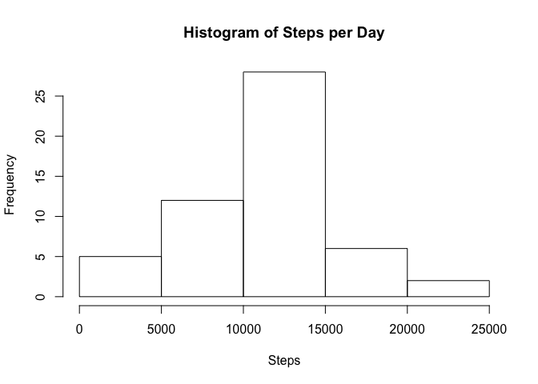
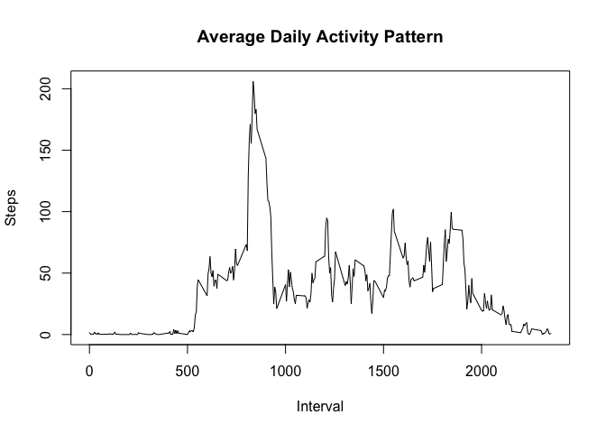
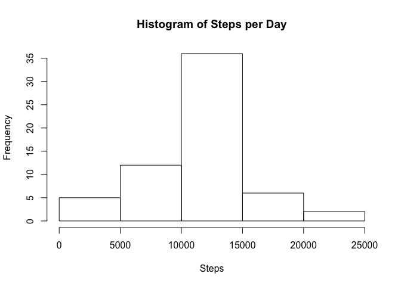

# Reproducible Research: Peer Assessment 1
## Loading and preprocessing the data
### 1

```r
## Load and process data
## 1 and 2
unzip("activity.zip")
activity <- read.csv("activity.csv")
```

## What is mean total number of steps taken per day?
### 2

```r
# load required packages
library(dplyr)
```

```
## 
## Attaching package: 'dplyr'
```

```
## The following objects are masked from 'package:stats':
## 
##     filter, lag
```

```
## The following objects are masked from 'package:base':
## 
##     intersect, setdiff, setequal, union
```

```r
# pivot by day
act_per_day <- group_by(activity, date)
act_per_day <- summarize(act_per_day, steps = sum (steps))
# plot
# 1
hist(act_per_day$steps, main="Histogram of Steps per Day", xlab="Steps")
```

<!-- -->

```r
# mean and median
# 2
mean <- mean(act_per_day$steps, na.rm = TRUE)
median <- median(act_per_day$steps, na.rm = TRUE)
```
### 3
The **mean** steps per day is **1.0766189\times 10^{4}** and the **median** steps per day is **10765**. 


## What is the average daily activity pattern?
### 4

```r
# pivot by interval
act_per_int <- group_by(activity, interval)
act_per_int <- summarize(act_per_int, steps = mean(steps,na.rm=TRUE))
# plot
# 1
plot(act_per_int$interval, act_per_int$steps, type="l", ylab="Steps", xlab="Interval", main="Average Daily Activity Pattern")
```

<!-- -->

```r
# find top interval
# 2
max <- act_per_int[order(act_per_int$steps,decreasing=T),]
max <- max[1,1]
```
### 5
The average top **interval** of the day is **835**. 


## Imputing missing values
### 6

```r
# count nulls
# 1
missing <- nrow(activity[is.na(activity$steps),])
# impute
# 2 & 3
# set intervals for loop
intervals <- unique(activity$interval)
# create new data set to add imputation
activity2 <- activity
# loop by interval, add mean to NA values
for(i in 1:length(intervals)) {
    interval_i <- intervals[i]
    activity2$steps[which(is.na(activity2$steps) & activity$interval==interval_i)] <- mean(activity2$steps[activity$interval==interval_i],na.rm=TRUE)
}
```
### 7

```r
# rerun analysis with new imputed data set
# 4
# pivot by day
act_per_day2 <- group_by(activity2, date)
act_per_day2 <- summarize(act_per_day2, steps = sum (steps))
# plot
hist(act_per_day2$steps, main="Histogram of Steps per Day", xlab="Steps")
```

<!-- -->

```r
# mean and median
mean2 <- mean(act_per_day2$steps)
median2 <- median(act_per_day2$steps)
```
The **mean** steps per day is **1.0766189\times 10^{4}** and the **median** steps per day is **1.0766189\times 10^{4}**. With imputed values, the 10,000-15,000 bin has more values, making the data set more homogeneous. 

## Are there differences in activity patterns between weekdays and weekends?
### 8

```r
# create column for daytype
activity3 <- mutate(activity2, daytype="")
# change date to date field
activity3$date <- as.Date(activity3$date)
# loop and identify week days versus weekends
for(i in 1:nrow(activity3)){
    if(weekdays(activity3$date[i], abbreviate=FALSE) %in% c("Saturday","Sunday")){
         activity3$daytype[i] <- "Weekend"
    } else {
        activity3$daytype[i] <- "Weekday"
    }
}
# make new field factors
# 1
activity3$daytype <- factor(activity3$daytype)
# reshape data to summarize averages
act_per_type <- group_by(activity3, interval, daytype)
act_per_type <- summarize(act_per_type, steps = mean(steps,na.rm=TRUE))
# plot panel
# 2
library(lattice)
xyplot(steps~interval | as.factor(daytype), data = act_per_type, layout=c(1,2), type="l")
```

<!-- -->

Yes! Activity is concentrated into the morning on the weekdays, but is more evenly distributed throught the day. People do not seem to be getting their steps in at work.

### 9
All code included in PA1_template.Rmd
